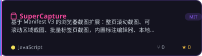
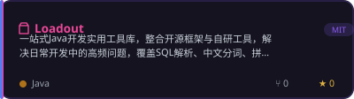
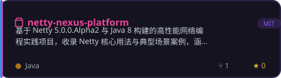
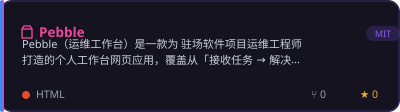
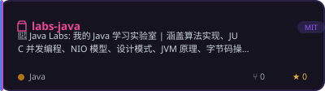
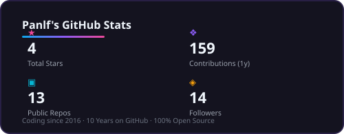
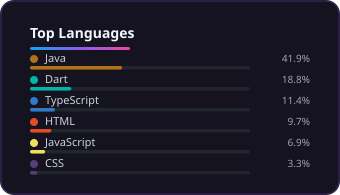
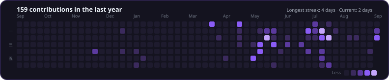

  
  
  
  

---

## 🧭 About Me

> 你好，我是 **Panlf**，一名来自 **杭州** 的软件开发工程师 🏃
>
> 白天，我与 **JVM、并发、Netty** 为伴，在字节码与调用栈之间雕琢高性能后端服务；
> 夜晚，我切换身份 —— 用 **Tauri** 打造桌面应用，用 **Flutter** 构建移动端，
> 为浏览器写 **Manifest V3 扩展**，用脚本驯服日常运维的琐碎。
>
> 我信奉 **Local-first · 隐私优先**：数据应该留在用户手里，工具应该轻得让人忘记它的存在。

- 🔭 **后端深耕**：JUC 并发、NIO、JVM 与字节码、Netty 高性能网络编程
- 🌱 **跨界造物**：Tauri 2 桌面应用 / Flutter 移动端 / Chrome 扩展 / Svelte & Vue
- 🛠 **工程效率**：Java 工具库、运维工作台、开发脚手架，把重复劳动自动化到底
- ✍️ **持续输出**：踩坑方案与实操教程沉淀在 [DevArchive](https://github.com/Panlf/DevArchive)
- ⚡ **信条**：*The best preparation for tomorrow is doing your best today.*

## ⚡ Tech Stack

**🪐 语言核心**

**⚙️ 后端 · 服务端**

**🖥 桌面 · 移动 · 前端**

**🗄 数据 · 云原生**

**🧰 工具链**

## 🚀 Featured Projects

<b>🧩 更多造物</b> <i>(点击展开)</i>

 

| 项目 | 简介 |
| --- | --- |
| 🔋 [fuel_track](https://github.com/Panlf/fuel_track) | 隐私优先的油耗追踪 App，数据全程本地 SQLite，不上云、不妥协 |
| 🍳 [cook_lottery](https://github.com/Panlf/cook_lottery) | 菜盒日记 —— Flutter 菜谱管理与「今天吃什么」随机点餐神器 |
| 📝 [md-view](https://github.com/Panlf/md-view) | Tauri 2 + Svelte 打造的轻量本地 Markdown 阅读编辑器 |
| 🐚 [TermWisp](https://github.com/Panlf/TermWisp) | 轻量化脚本集，把日常开发运维的琐碎一键扫清 |
| 🪺 [BootNest](https://github.com/Panlf/BootNest) | Spring Boot 多功能演示巢，组件集成的最佳实践样本 |
| 📚 [DevArchive](https://github.com/Panlf/DevArchive) | 踩坑方案与实操教程：Git / Java / Linux / MySQL / K8s / 前端 |

## 📊 GitHub Stats

  
  
  
  

## 🐍 Contribution Snake

<picture>
  <source media="(prefers-color-scheme: dark)" srcset="https://raw.githubusercontent.com/Panlf/Panlf/output/github-contribution-grid-snake-dark.svg"/>
  <source media="(prefers-color-scheme: light)" srcset="https://raw.githubusercontent.com/Panlf/Panlf/output/github-contribution-grid-snake.svg"/>
  
</picture>

## 🌐 Connect with Me

*「 The best preparation for tomorrow is doing your best today. 」*

